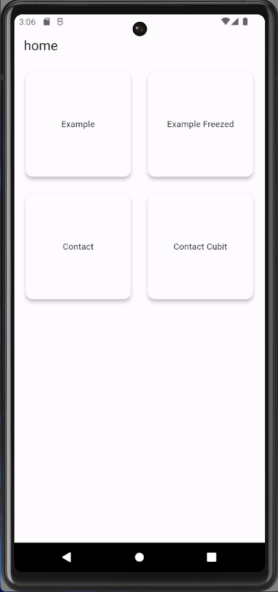
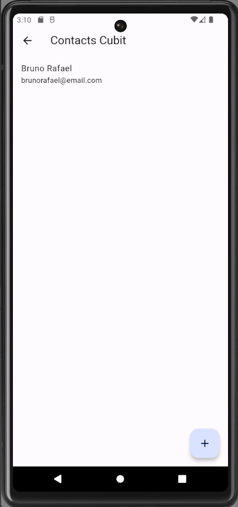
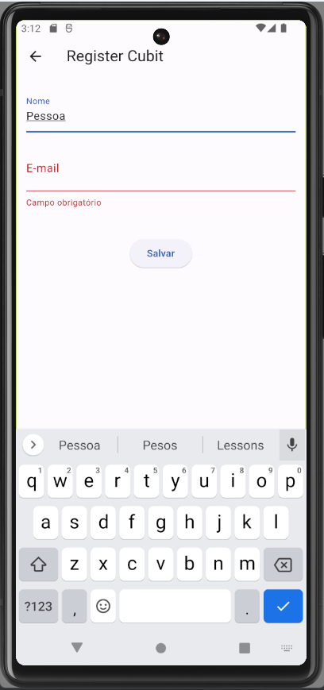
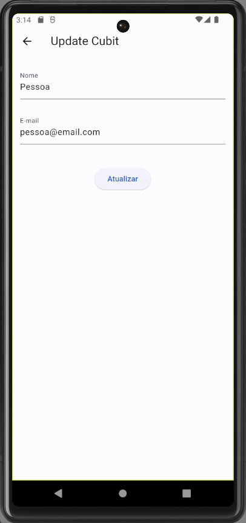

## Counter Bloc
This is a flutter app, developed for practice.
This application addresses bloc and cubit architecture with its concepts

## Technology 

Here are the technologies used in this project.

* Flutter version  3.10.0
* Dart version 3.0.0

## Techniques Used
* Flutter Bloc

## Services Used

* Github

## Getting started

* Dependency
  - Flutter environment   

## Pages
* **Home**   
* **Contacts**   
* **Register**   
* **Update**   

## Links
  - Repository: https://github.com/RFBruno/flutter-todo-br

  ## Versioning

  1.0.0.0

  ## Authors

  * **Bruno Rafael** 

  Please follow github and join us!
  Thanks to visiting me and good coding!
